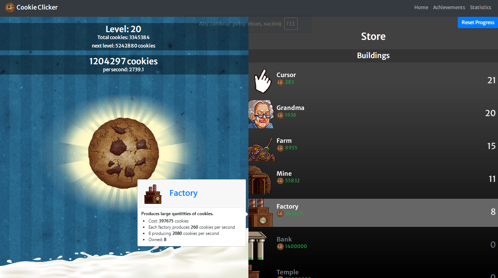

# Cookie Clicker

Cookie Clicker is an "incrementer" game. The point of the game is to bake cookies by clicking on a giant cookie until you have enough cookies to buy buildings.

The seemingly endless gameplay makes it a game that can last an indefinite amount of time, or at least until your device can no longer run it.

Original [Cookie Clicker](http://orteil.dashnet.org/cookieclicker/) is a Javascript game released by [Orteil](https://cookieclicker.fandom.com/wiki/Orteil) on August 8, 2013.

<div align="center">
  
</div>

## Technologies

| Tech                                          | Description                          |
| --------------------------------------------- | ------------------------------------ |
| [React](https://reactjs.org/)                 | Library for building user interfaces |
| [Typescript](https://www.typescriptlang.org/) | Javascript superset language         |
| [MobX](https://mobx.js.org/)                  | Simple, scalable state management    |
| [Bootstrap](https://getbootstrap.com/)        | UI library                           |
| [ESLint](https://eslint.org/)                 | Javascript Linter                    |
| [Prettier](https://prettier.io/)              | Code formatter                       |

## Installation

```bash

git clone https://github.com/eszczepan/Cookie-clicker

npm install

npm run start

```

## Available scripts

| Command         | Description            |
| --------------- | ---------------------- |
| `npm run start` | Open local server      |
| `npm run build` | Create optimized build |
| `npm run test`  | Run tests              |
| `npm run eject` | Eject CRA              |

## Live

<a href="https://clicker-cookie.netlify.app/">https://clicker-cookie.netlify.app/</a>

## Resources

- The images used in the project come from [Cookie Clicker Wiki](https://cookieclicker.fandom.com/wiki/Category:Images)
